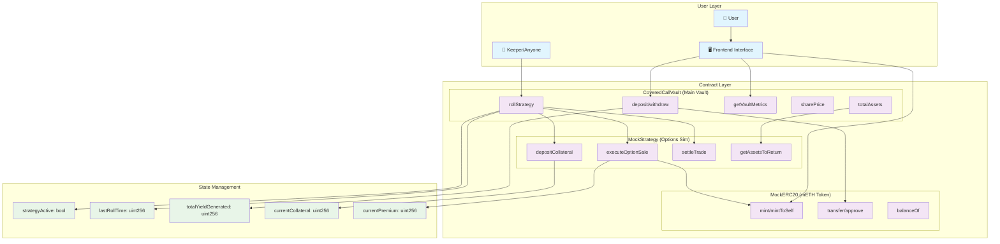

# DOV Contract Architecture & Flow

## 📋 Contract Overview

Our DOV system consists of three main contracts that work together to create a decentralized options vault:

### 1. **MockERC20.sol** - Test Token Contract
### 2. **CoveredCallVault.sol** - Main Vault (ERC-4626)
### 3. **MockStrategy.sol** - Options Strategy Simulator

---

## 🏗️ Contract Details

### 1. MockERC20.sol - Test Token Contract

**Purpose**: Provides test tokens (mETH) for the vault system

#### Essential Functions:
```solidity
// Standard ERC20 functions
function transfer(address to, uint256 amount) external returns (bool)
function approve(address spender, uint256 amount) external returns (bool)
function balanceOf(address account) external view returns (uint256)

// Testing functions
function mint(address to, uint256 amount) external onlyOwner
function mintToSelf(uint256 amount) external  // Anyone can mint for testing
```

#### Key Features:
- ✅ Standard ERC20 implementation
- ✅ Minting capabilities for testing
- ✅ Owner controls for production use
- ✅ Self-minting for easy testing

---

### 2. CoveredCallVault.sol - Main Vault Contract

**Purpose**: ERC-4626 compliant vault that manages user deposits and coordinates with strategy

#### Essential Functions:

##### **User Functions (ERC-4626 Standard):**
```solidity
function deposit(uint256 assets, address receiver) external returns (uint256 shares)
function withdraw(uint256 assets, address receiver, address owner) external returns (uint256 shares)
function redeem(uint256 shares, address receiver, address owner) external returns (uint256 assets)
function balanceOf(address account) external view returns (uint256)
function totalAssets() public view override returns (uint256)
```

##### **Strategy Management:**
```solidity
function rollStrategy() external nonReentrant  // Keeper function
function setStrategy(address _strategy) external onlyOwner
function emergencySettleStrategy() external onlyOwner
```

##### **Metrics & Info:**
```solidity
function getVaultMetrics() external view returns (uint256 tvl, uint256 sharePrice, uint256 totalYield, bool isStrategyActive, uint256 nextRollTime)
function sharePrice() external view returns (uint256)
function canRollStrategy() external view returns (bool)
function timeUntilNextRoll() external view returns (uint256)
```

#### Key Features:
- ✅ ERC-4626 compliance (standard vault interface)
- ✅ Automatic share price calculation
- ✅ Strategy integration and management
- ✅ Time-based roll restrictions (7 days)
- ✅ Emergency controls
- ✅ Yield tracking and distribution

---

### 3. MockStrategy.sol - Options Strategy Simulator

**Purpose**: Simulates covered call options trading and yield generation

#### Essential Functions:

##### **Vault Integration:**
```solidity
function setVault(address _vault) external onlyOwner
function depositCollateral(uint256 amount) external onlyVault
function executeOptionSale(uint256 collateral) external onlyVault
function settleTrade() external onlyVault returns (uint256)
function getAssetsToReturn() external view returns (uint256)
```

##### **Strategy Management:**
```solidity
function setPremiumRate(uint256 _premiumRate) external onlyOwner  // Default: 5%
function forceSettle(uint8 _optionStatus) external onlyOwner      // Testing only
function emergencyWithdraw() external onlyOwner
```

##### **State Tracking:**
```solidity
function currentCollateral() external view returns (uint256)
function currentPremium() external view returns (uint256)
function hasActivePosition() external view returns (bool)
function optionStatus() external view returns (uint8)  // 0=OTM, 1=ITM
```

#### Key Features:
- ✅ Simulates options market interaction
- ✅ Automatic premium generation (5% default)
- ✅ Pseudo-random settlement outcomes
- ✅ Configurable premium rates
- ✅ Emergency controls and testing functions

---

## 🔄 System Flow Diagram



## 🎯 Detailed Interaction Flow

### **Phase 1: Initial Setup**
```
1. Deploy MockERC20 → Create test token
2. Deploy MockStrategy → Set up options simulator  
3. Deploy CoveredCallVault → Create main vault
4. Connect contracts → strategy.setVault() & vault.setStrategy()
```

### **Phase 2: User Deposits**
```
User → mintToSelf(1000) → MockERC20
User → approve(vault, 100) → MockERC20
User → deposit(100, user) → CoveredCallVault
    ↓
CoveredCallVault → transferFrom(user, vault, 100) → MockERC20
CoveredCallVault → _mint(user, 100) → Internal (shares)
```

### **Phase 3: Strategy Activation**
```
Keeper → rollStrategy() → CoveredCallVault
    ↓
CoveredCallVault → approve(strategy, 100) → MockERC20
CoveredCallVault → depositCollateral(100) → MockStrategy
    ↓
MockStrategy → transferFrom(vault, strategy, 100) → MockERC20
MockStrategy → executeOptionSale(100) → Internal
    ↓
MockStrategy → mint(strategy, 5) → MockERC20 (premium)
MockStrategy → strategyActive = true
```

### **Phase 4: Settlement & Yield**
```
Time passes (7 days) OR Owner → forceSettle(0)
    ↓
Keeper → rollStrategy() → CoveredCallVault
    ↓
CoveredCallVault → settleTrade() → MockStrategy
    ↓
MockStrategy → transfer(vault, 105) → MockERC20 (if OTM)
MockStrategy → return 105 → CoveredCallVault
    ↓
CoveredCallVault → totalYieldGenerated += 5
CoveredCallVault → sharePrice = 1.05 (5% increase)
```

### **Phase 5: User Withdrawal**
```
User → redeem(50, user, user) → CoveredCallVault
    ↓
CoveredCallVault → _burn(user, 50) → Internal (shares)
CoveredCallVault → transfer(user, 52.5) → MockERC20 (profit!)
```

## 🔐 Access Control Matrix

| Function | MockERC20 | CoveredCallVault | MockStrategy |
|----------|-----------|------------------|--------------|
| **Public** | transfer, approve, balanceOf | deposit, withdraw, redeem, getVaultMetrics | getAssetsToReturn, view functions |
| **Anyone** | mintToSelf | rollStrategy | - |
| **Owner Only** | mint | setStrategy, emergencySettle, setRollInterval | setVault, setPremiumRate, forceSettle, emergencyWithdraw |
| **Vault Only** | - | - | depositCollateral, executeOptionSale, settleTrade |

## 📊 State Transitions

### **Vault States:**
```
INACTIVE → [rollStrategy] → ACTIVE → [settleTrade] → INACTIVE
```

### **Strategy States:**
```
NO_POSITION → [executeOptionSale] → ACTIVE_POSITION → [settleTrade] → NO_POSITION
```

### **Share Price Evolution:**
```
1.0000 → [deposit] → 1.0000 → [profitable settlement] → 1.0500 → [loss settlement] → 0.0525
```

## 🎮 Testing Functions

### **For Development:**
- `mintToSelf()` - Get test tokens
- `forceSettle()` - Control outcomes
- `emergencyWithdraw()` - Reset state

### **For Production:**
- Remove `mintToSelf()` 
- Remove `forceSettle()`
- Add real oracle integration

---

This architecture provides a complete, testable implementation of a decentralized options vault with clear separation of concerns and robust state management.
