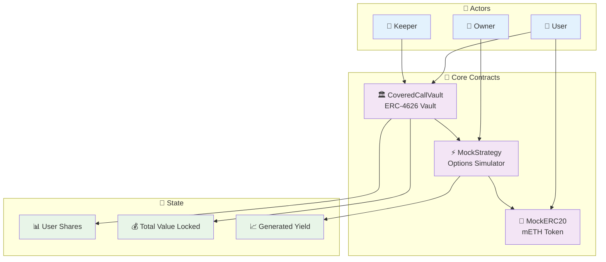
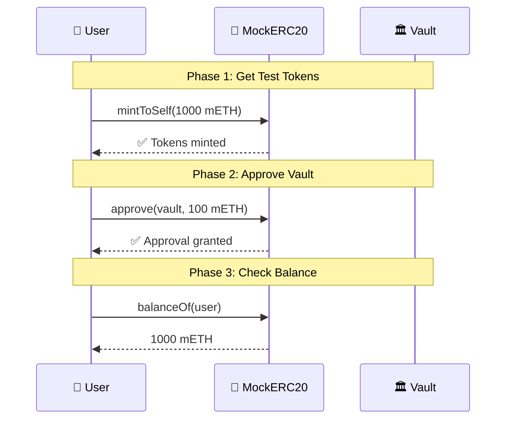
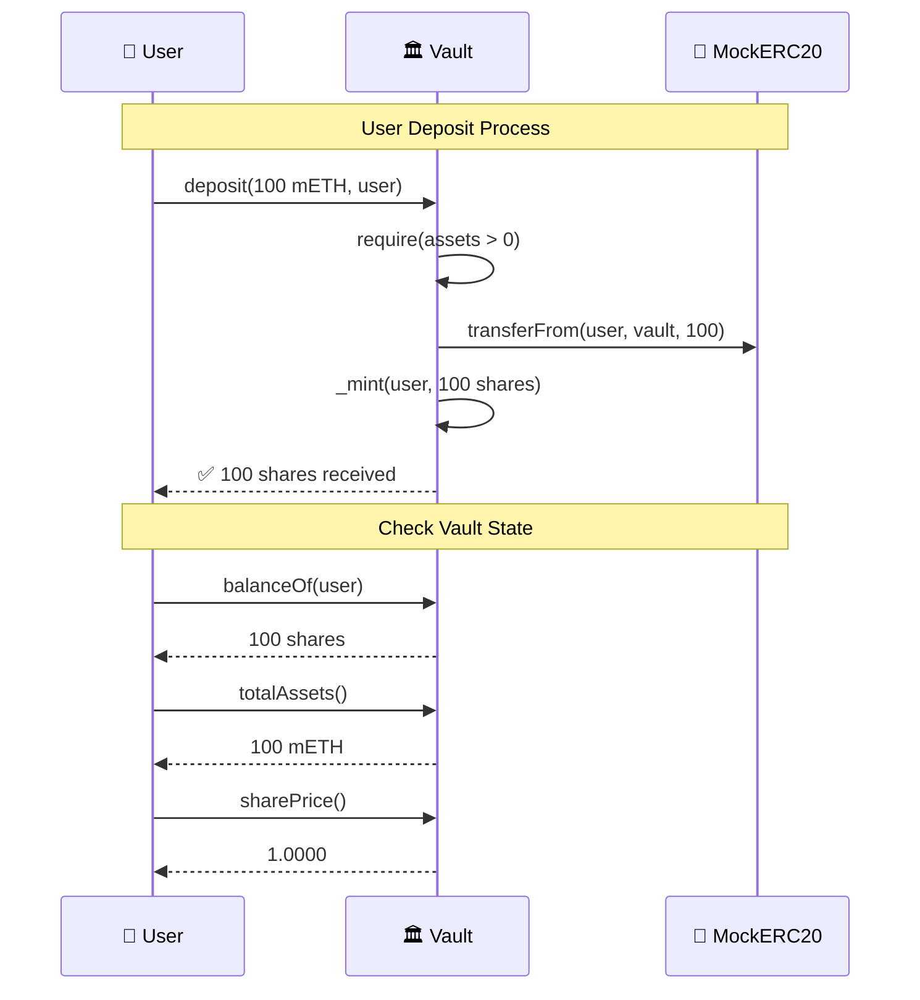
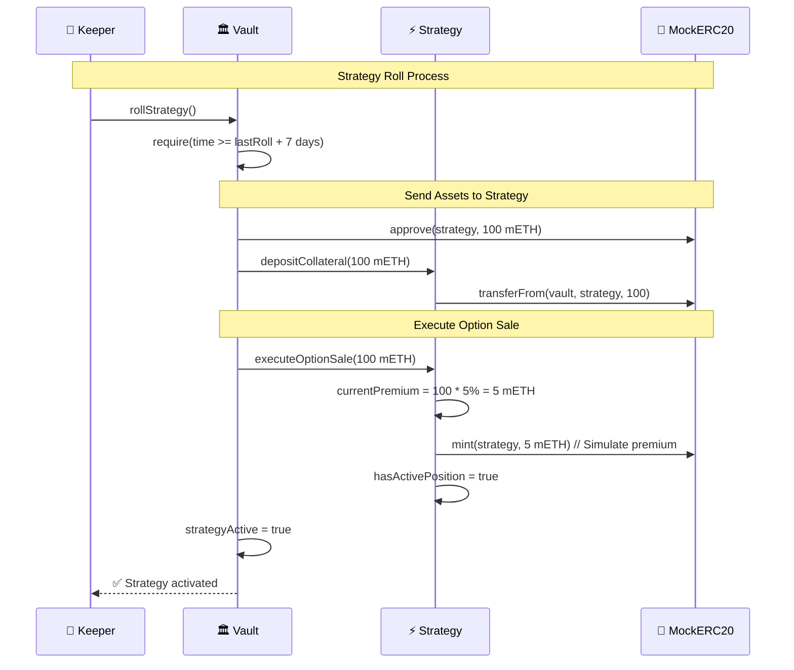
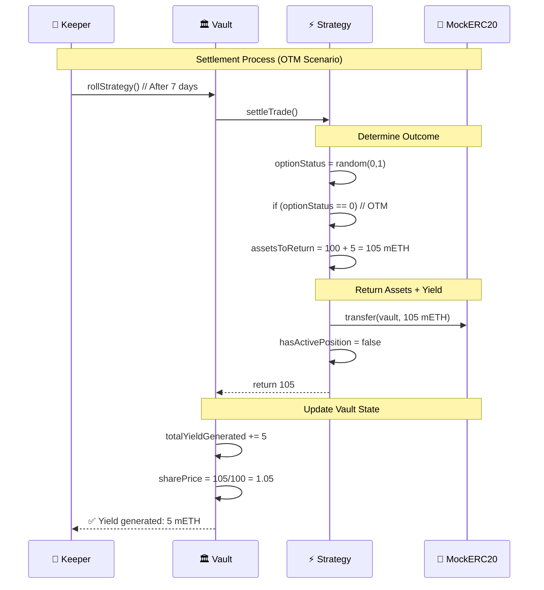
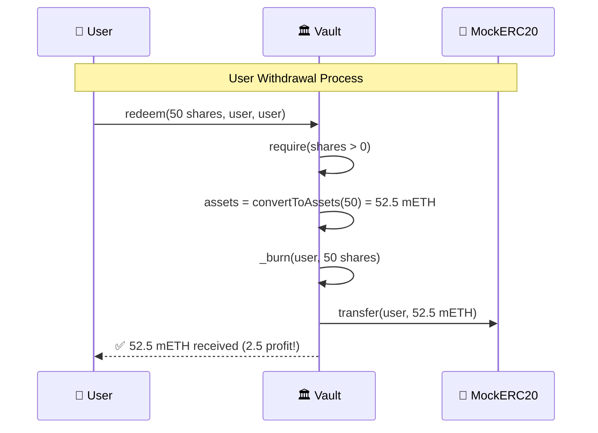
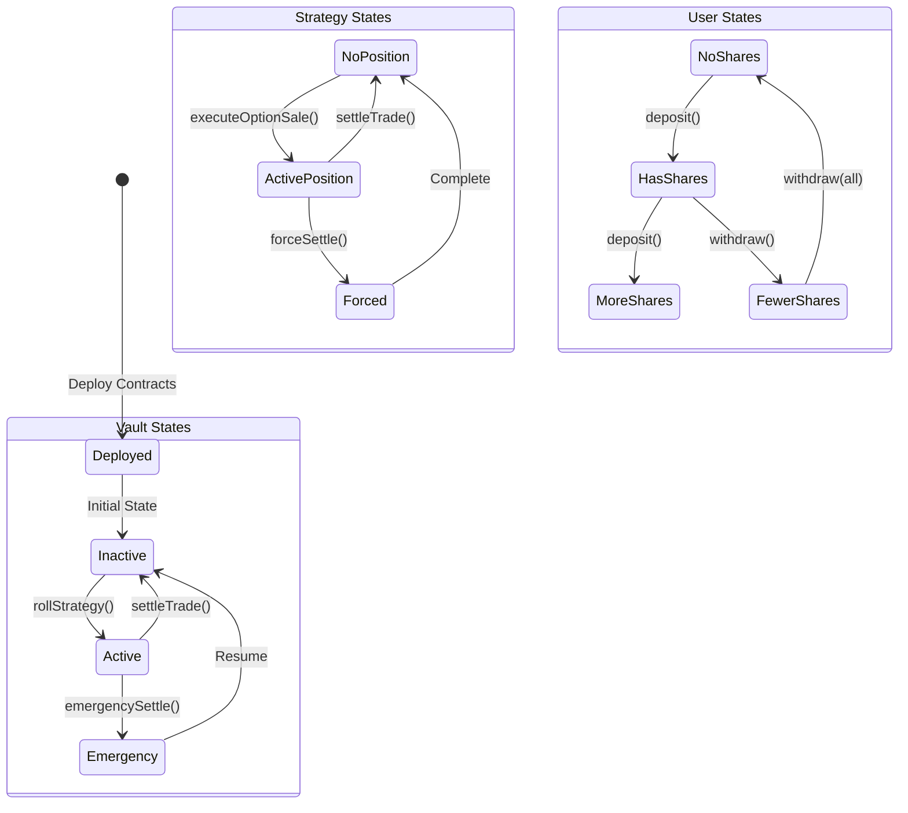
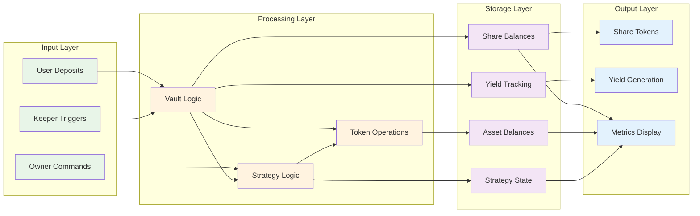

# DOV System Flowchart - Complete Interaction Flow

## 🎯 High-Level System Overview

## 🔄 Detailed Function Flow

### **1. Token Management Flow**

### **2. Deposit & Share Management Flow**

### **3. Strategy Activation Flow**

### **4. Settlement & Yield Generation Flow**

### **5. Withdrawal Flow**

## 📋 Complete State Machine

## 🎮 Function Call Hierarchy

```mermaid
graph TD
    subgraph "User Functions"
        UF1[mintToSelf]
        UF2[deposit]
        UF3[withdraw/redeem]
        UF4[balanceOf]
    end

    subgraph "Keeper Functions"
        KF1[rollStrategy]
    end

    subgraph "Owner Functions"
        OF1[setStrategy]
        OF2[setPremiumRate]
        OF3[forceSettle]
        OF4[emergencySettle]
    end

    subgraph "Internal Calls"
        IC1[depositCollateral]
        IC2[executeOptionSale]
        IC3[settleTrade]
        IC4[getAssetsToReturn]
    end

    subgraph "View Functions"
        VF1[totalAssets]
        VF2[sharePrice]
        VF3[getVaultMetrics]
        VF4[canRollStrategy]
    end

    UF1 --> TOKEN
    UF2 --> VAULT
    UF3 --> VAULT
    UF4 --> VAULT

    KF1 --> VAULT
    KF1 --> IC1
    KF1 --> IC2
    KF1 --> IC3

    OF1 --> VAULT
    OF2 --> STRATEGY
    OF3 --> STRATEGY
    OF4 --> VAULT

    IC1 --> STRATEGY
    IC2 --> STRATEGY
    IC3 --> STRATEGY
    IC4 --> STRATEGY

    VF1 --> VAULT
    VF2 --> VAULT
    VF3 --> VAULT
    VF4 --> VAULT

    classDef userFunc fill:#e3f2fd
    classDef keeperFunc fill:#fff3e0
    classDef ownerFunc fill:#fce4ec
    classDef internalFunc fill:#f1f8e9
    classDef viewFunc fill:#f3e5f5

    class UF1,UF2,UF3,UF4 userFunc
    class KF1 keeperFunc
    class OF1,OF2,OF3,OF4 ownerFunc
    class IC1,IC2,IC3,IC4 internalFunc
    class VF1,VF2,VF3,VF4 viewFunc
```

## 🔄 Data Flow Architecture

## 🎯 Key Integration Points

### **Contract Interfaces:**
1. **Vault ↔ Strategy**: `depositCollateral()`, `executeOptionSale()`, `settleTrade()`
2. **Vault ↔ Token**: `transfer()`, `approve()`, `transferFrom()`
3. **Strategy ↔ Token**: `mint()`, `transfer()` (for premium simulation)

### **State Synchronization:**
1. **strategyActive** (Vault) ↔ **hasActivePosition** (Strategy)
2. **totalAssets()** (Vault) includes **getAssetsToReturn()** (Strategy)
3. **sharePrice** reflects accumulated **totalYieldGenerated**

### **Access Control:**
1. **onlyVault** modifier protects strategy functions
2. **onlyOwner** modifier protects admin functions
3. **nonReentrant** modifier protects state-changing functions

This architecture ensures clean separation of concerns while maintaining tight integration for seamless operation.
